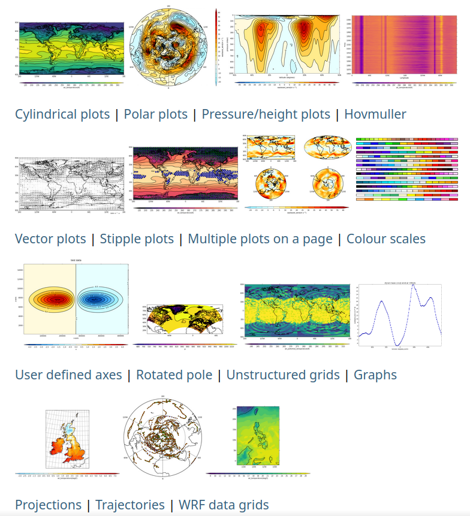

# cf-plot

## Code-light plotting for earth science and aligned research

cf-plot allows you to produce and customise publication-quality contour, vector, line and more plots
with the power of Python, matplotlib and Cartopy, in as few lines of code as possible.

It is designed to be a useful tool across the various domains in and around environmental and
earth science, including climate and meteorological research.

### Examples gallery

A gallery of outputs made with cf-plot, showcasing a range of plotting possibilities with links to relevant
documentation pages and to example code, can be found
[here, on a dedicated page within the documentation](http://ajheaps.github.io/cf-plot/gallery.html), as illustrated
in this (static) image:

### Documentation

Found under [the cf-plot homepage](http://ajheaps.github.io/cf-plot) (`http://ajheaps.github.io/cf-plot`).
