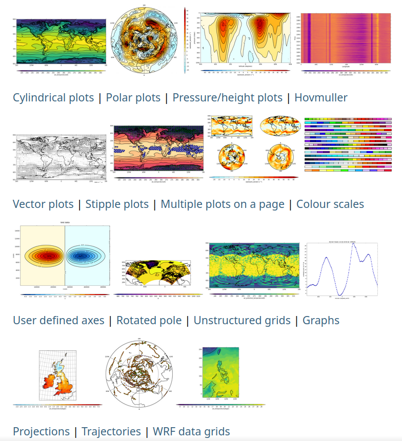

# cf-plot

## Code-light plotting for earth science and aligned research

### Overview



**cf-plot allows you to produce and customise publication-quality contour,
vector, line and more plots with the power of Python,
[matplotlib](https://matplotlib.org/),
[Cartopy](https://scitools.org.uk/cartopy/docs/latest/) and
[cf-python](https://ncas-cms.github.io/cf-python/), in as few lines of code
as possible.**

It is designed to be a useful visualisation tool for environmental, earth
and aligned sciences, for example to facilitate climate and meteorological
research. cf-plot is developed and maintained by the
[NCAS-CMS](https://cms.ncas.ac.uk/index.html) group, part of
[NCAS](https://ncas.ac.uk/).


### Brief Demonstration

In as little as four lines of Python including imports and file reading,
using `cf-plot` you can for example produce a contour plot showing a 2D
subspace of a netCDF dataset:

```python
import cf
import cfplot as cfp
f = cf.read('<dataset name>.nc')[0]  # picks out a read-in field of the dataset
cfp.con(f.subspace(time=<chosen time value>))  # creates a contour plot of the field at that time value
```


### Examples Gallery

A gallery of outputs made with cf-plot, showcasing a range of plotting
possibilities with links to relevant documentation pages and to example code,
can be found
[on this dedicated page within the documentation](http://ajheaps.github.io/cf-plot/gallery.html),
as illustrated in the (static) image at the top of this document.


### Documentation

See [the cf-plot homepage](http://ajheaps.github.io/cf-plot)
(`http://ajheaps.github.io/cf-plot`) for the full online documentation.


### Installation

To install cf-plot with its required dependencies, you can use `pip`:

```bash
pip install cf-python cf-plot
```

or you can use `conda` (or similar package managers such
as `mamba`) as follows (or equivalent):

```bash
conda install -c ncas -c conda-forge cf-python cf-plot udunits2
```

More detail about installation is provided on the
[installation page](http://ajheaps.github.io/cf-plot/download.html)
(`http://ajheaps.github.io/cf-plot/download.html`)
of the documentation.

### Contributing

Everyone is welcome to contribute to cf-plot in the form
of bug reports, documentation, code, design proposals, and more.

Contributing guidelines will be added to the repository shortly.


### Help: Issues, Questions, Feature Requests, etc.

For any queries, see the
[guidance page](http://ajheaps.github.io/cf-plot/issues.html)
(`http://ajheaps.github.io/cf-plot/issues.html`).
