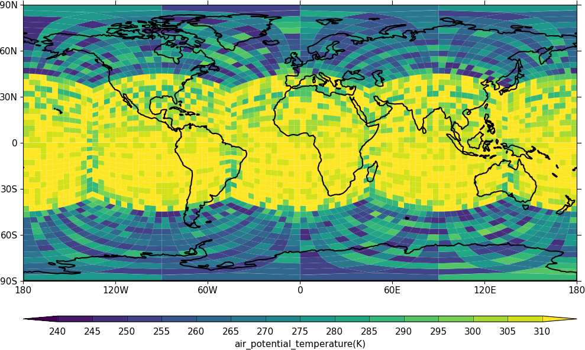

cf-plot gallery
===============

.. image::  images/fig1.png
   :scale: 14% 
   :target: cylindrical.html
.. image::  images/fig4.png
   :scale: 14%    
   :target: polar.html
.. image::  images/fig7.png
   :scale: 14%    
   :target: pressure.html
.. image::  images/fig12.png
   :scale: 14%    
   :target: hovmuller.html

:ref:`Cylindrical plots <cylindrical>` |
:ref:`Polar plots <polar>` |
:ref:`Pressure/height plots <pressure>` |
:ref:`Hovmuller<hovmuller>` 

.. image::  images/fig13.png
   :scale: 14%    
   :target: vectors.html
.. image::  images/fig17.png
   :scale: 14%    
   :target: stipple_plots.html
.. image::  images/fig19.png
   :scale: 14%    
   :target: multiple_plots.html
.. image::  images/cscale.png
   :scale: 20%    
   :target: colour_scales.html

:ref:`Vector plots <vector>` |
:ref:`Stipple plots <stipple>` |
:ref:`Multiple plots on a page<multiple_plots>` |
:ref:`Colour scales <colour_scales>`

.. image::  images/fig20.png
   :scale: 14%    
   :target: user_defined.html
.. image::  images/fig21.png
   :scale: 14%    
   :target: rotated_pole.html

.. image::  images/fig27.png
   :scale: 11%    
   :target: graphs.html

:ref:`User defined axes <user_defined>` |
:ref:`Rotated pole <rotated_pole>` |
:ref:`Unstructured grids<unstructured>` |
:ref:`Graphs <graphs>`

.. image::  images/fig31.png
   :scale: 14%    
   :target: projections.html

.. image::  images/fig40.png
   :scale: 14%    
   :target: trajectories.html

.. image::  images/fig43.png
   :scale: 14%    
   :target: wrf.html

:ref:`Projections <projections>` |
:ref:`Trajectories <trajectories>` |
:ref:`WRF data grids<wrf>`

