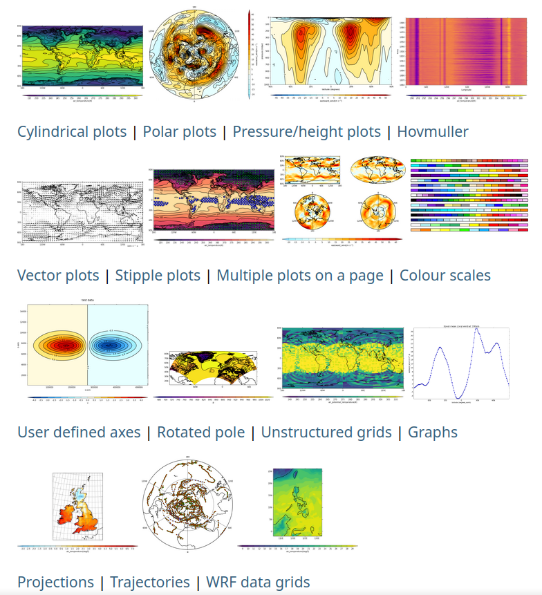

*********************
cf-plot documentation
*********************

**cf-plot: code-light plotting for earth science and aligned research**

.. Define external links to use in the docs here

.. _matplotlib:  https://matplotlib.org/
.. _Cartopy:     https://scitools.org.uk/cartopy/docs/latest/
.. _cf-python:   https://ncas-cms.github.io/cf-python/
.. _NCAS-CMS:    https://cms.ncas.ac.uk/index.html
.. _NCAS:        https://ncas.ac.uk/

.. TODO update these to internal links once can go through and reference each page
.. _gallery page:         https://ncas-cms.github.io/cf-plot/build/gallery.html
.. _installation page:    https://ncas-cms.github.io/cf-plot/build/download.html
.. _guidance page here:   https://ncas-cms.github.io/cf-plot/build/issues.html

########
Overview
########

cf-plot allows you to produce and customise publication-quality contour, vector,
line and more plots with the power of Python, `matplotlib`_,
`Cartopy`_ and `cf-python`_ in as few lines of code as possible.

It is designed to be a useful visualisation tool for environmental, earth and
aligned sciences, for example to facilitate climate and meteorological research.
cf-plot is developed and maintained by the `NCAS-CMS`_ group, part of `NCAS`_.

###################
Brief Demonstration
###################

In as little as four lines of Python including imports and file reading, using
cf-plot you can for example produce a contour plot showing a 2D subspace of a
netCDF dataset:

.. code-block:: python

   import cf
   import cfplot as cfp
   f = cf.read('<dataset name>.nc')[0]  # picks out a read-in field of the dataset
   cfp.con(f.subspace(time=<chosen time value>))  # creates a contour plot of the field at that time value

################
Examples Gallery
################

A gallery of outputs made with cf-plot, showcasing a range of plotting
possibilities with links to relevant documentation pages and to example code,
can be found on the `gallery page`_, as also linked to the static image
of the gallery at the to of this page.

############
Installation
############

To install cf-plot with its required dependencies, you can use pip:

.. code-block:: bash

   pip install cf-python cf-plot

or you can use conda (or similar package managers such as mamba) as follows
(or equivalent):

.. code-block:: bash

   conda install -c ncas -c conda-forge cf-python cf-plot udunits2

More detail about installation is provided on the
`installation page`_ of the documentation.

############
Contributing
############

Everyone is welcome to contribute to cf-plot in the form of bug reports,
documentation, code, design proposals, and more.

Contributing guidelines will be added to the repository shortly.

###############################################
Help: Issues, Questions, Feature Requests, etc.
###############################################

For any queries, see the `guidance page here`_.
