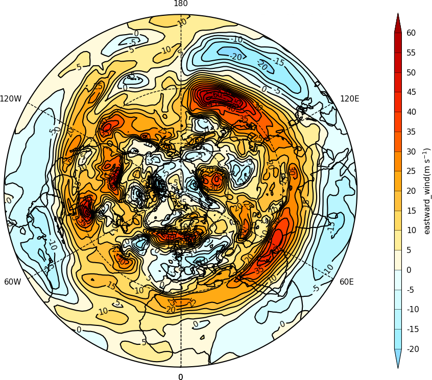
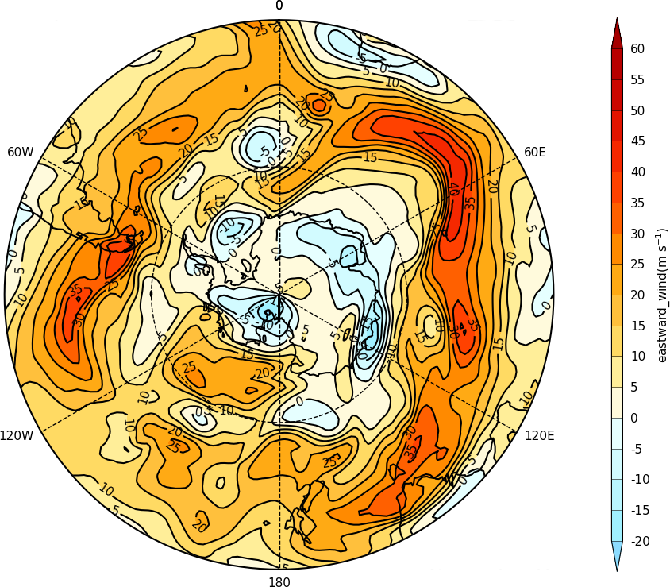

.. _polar:
Polar stereographic projection
******************************

Example 4 - north pole
----------------------

::

   import cf
   import cfplot as cfp
   f=cf.read('cfplot_data/ggap.nc')[1]
   cfp.mapset(proj='npstere')
   cfp.con(f.subspace(pressure=500))

| 
| 
| 
|

Example 5 - south pole with 30 degrees south being the latitude plot limit
--------------------------------------------------------------------------

::

   import cf
   import cfplot as cfp
   f=cf.read('cfplot_data/ggap.nc')[1]
   cfp.mapset(proj='spstere', boundinglat=-30, lon_0=0)
   cfp.con(f.subspace(pressure=500))

