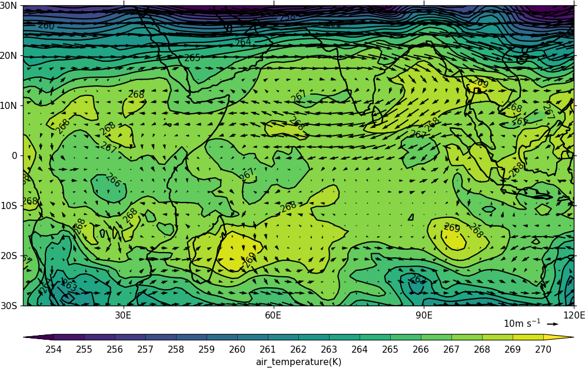
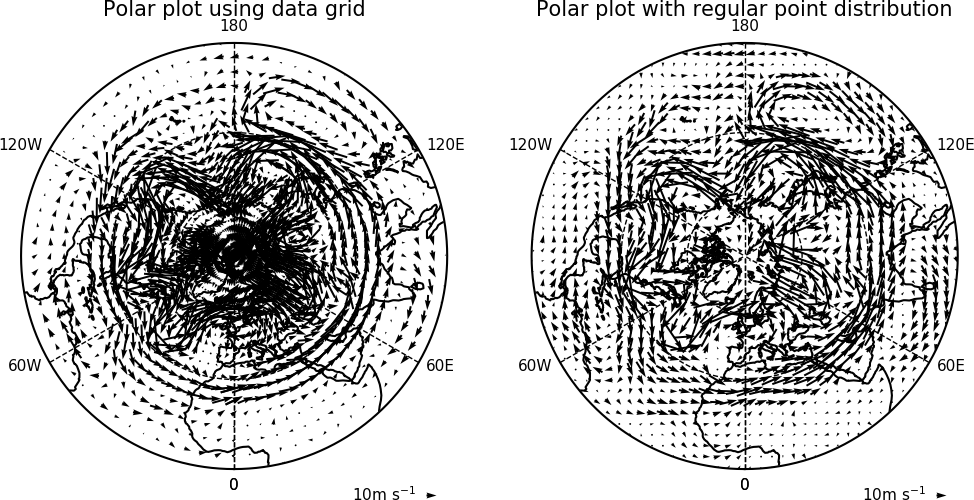
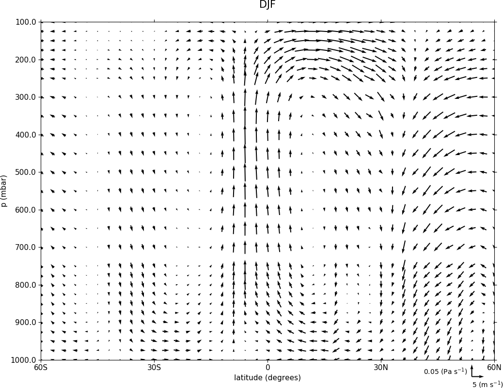
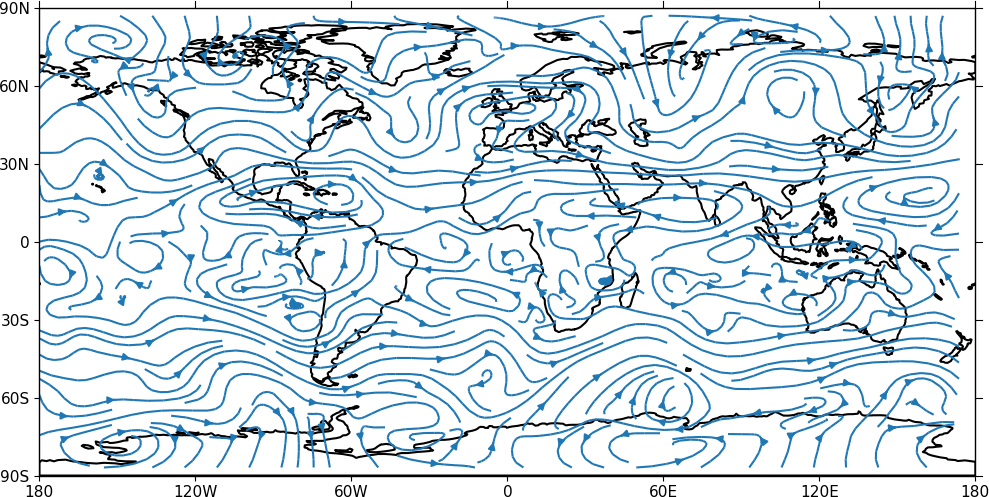
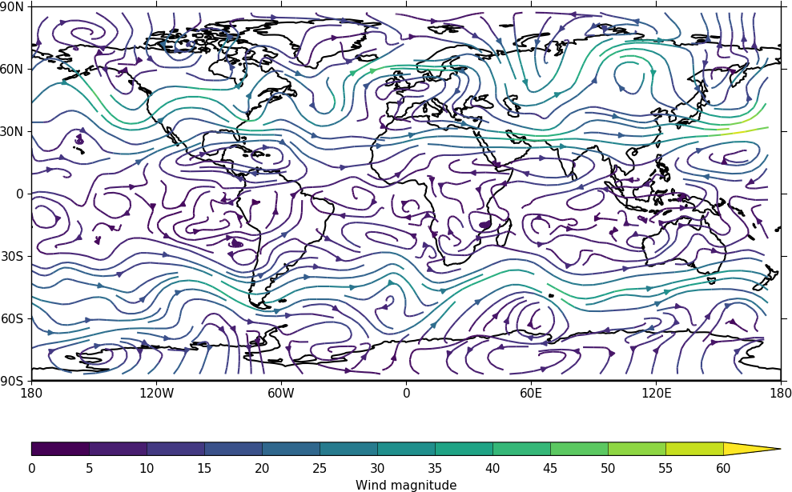

.. _vector:
Vector and stream plots
***********************

Example 13 - vector plot
------------------------

.. image::  images/fig13.png
   :scale: 44% 

::

   import cf
   import cfplot as cfp
   f=cf.read('cfplot_data/ggap.nc')
   u=f[1].subspace(pressure=500)
   v=f[2].subspace(pressure=500)
   cfp.vect(u=u, v=v, key_length=10, scale=100, stride=5)

Example 14 - vector plot with colour contour map 
------------------------------------------------

::

   import cf
   import cfplot as cfp
   f=cf.read('cfplot_data/ggap.nc')
   u=f[1].subspace(pressure=500)
   v=f[2].subspace(pressure=500)
   t=f[0].subspace(pressure=500)

   cfp.gopen()
   cfp.mapset(lonmin=10, lonmax=120, latmin=-30, latmax=30)
   cfp.levs(min=254, max=270, step=1)
   cfp.con(t)
   cfp.vect(u=u, v=v, key_length=10, scale=50, stride=2)
   cfp.gclose()

| 

In this plot we overlay a vector plot on a contoured temperature field.

Example 15 - polar vector plot
------------------------------

Here we see the difference between plotting the vectors on the data grid and on a interpolated grid.
The supplied grid gives a bullseye effect making the wind direction difficult to see near the pole.

::

   import cf
   import cfplot as cfp

   u=cf.read('cfplot_data/ggap.nc')[1]
   v=cf.read('cfplot_data/ggap.nc')[2]
   u=u.subspace(Z=500)
   v=v.subspace(Z=500)

   cfp.mapset(proj='npstere')
   cfp.gopen(columns=2)
   cfp.vect(u=u, v=v, key_length=10, scale=100, stride=4, title='Polar plot using data grid')
   cfp.gpos(2)
   cfp.vect(u=u, v=v, key_length=10, scale=100, pts=40, title='Polar plot with regular point distribution')
   cfp.gclose()

Example 16 - zonal vector plot
------------------------------

::

    import cf
    import cfplot as cfp

    c=cf.read('cfplot_data/vaAMIPlcd_DJF.nc')[0]
    c=c.subspace(Y=cf.wi(-60,60))
    c=c.subspace(X=cf.wi(80,160))  
    c=c.collapse('T: mean X: mean')

    g=cf.read('cfplot_data/wapAMIPlcd_DJF.nc')[0]    
    g=g.subspace(Y=cf.wi(-60,60))
    g=g.subspace(X=cf.wi(80,160))
    g=g.collapse('T: mean X: mean')

    cfp.vect(u=c, v=-1*g, key_length=[5, 0.05], scale=[20,0.2], title='DJF', key_location=[0.95, -0.05])

Here we make a zonal mean vector plot with different vector keys and scaling factors for the X and Y directions.

Example 16b - stream plot - basic
---------------------------------

A streamplot is used to show fluid flow and 2D field gradients.  In this first example the data goes from 0 to 358.875 in longitude.  The cartopy / matplotlib interface seems to need the data to be inside the data window in longitude so we anchor the data in cf-python using the anchor method to start at -180 in longitude.  If we didn't do this any longitudes less than zero would have no streams drawn. 

::

    import cf
    import cfplot as cfp
    import numpy as np
    f=cf.read('cfplot_data/ggap.nc')
    u = f[1].subspace(pressure=500)
    v = f[2].subspace(pressure=500)

    u = u.anchor('X', -180)
    v = v.anchor('X', -180)
 
    cfp.stream(u=u, v=v, density=2)

Example 16c - stream plot - enhanced
------------------------------------

In the second streamplot example a colorbar showing the intensity of the wind is drawn.

::

    magnitude = (u ** 2 + v ** 2) ** 0.5
    mag = np.squeeze(magnitude.array)

    cfp.levs(0, 60, 5, extend='max')
    cfp.cscale('viridis', ncols=13) 
    cfp.gopen()
    cfp.stream(u=u, v=v, density=2, color=mag)
    cfp.cbar(levs=cfp.plotvars.levels, position=[0.12, 0.12, 0.8, 0.02], title='Wind magnitude')
    cfp.gclose()

